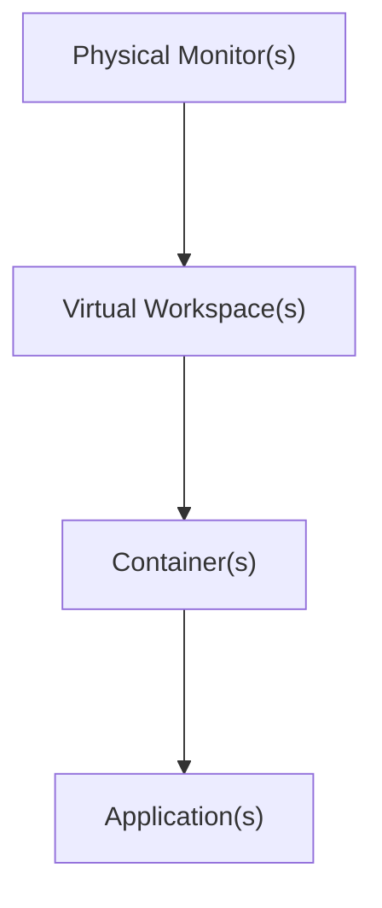

## List of Contents

- [[Komorebi Window Tiling Manager#What is Komorebi? | What is Komorebi?]]
- [[Komorebi Window Tiling Manager#Getting Started| Getting Started]]
- [[Komorebi Window Tiling Manager#Running | Running]]
- [[Komorebi Window Tiling Manager#WHKDRC File / Keymaps | WHKDRC File / Keymaps]]

---

# What is Komorebi?

It is a **desktop window manager**, i.e *DWM*. It works as an extension to *Windows*'s *Desktop Window Manager*

- You can set **custom** key bindings / keyboard shortcuts with [AutoHotKey](https://github.com/AutoHotkey/AutoHotkey)
- Komorebi will try to make as *little* to no changes at all to the OS.
- Users are able to:
  1. Create a **configuration** file
  2. Make changes to Komorebi with said *configuration* file

Author of Komorebi's YouTube Channel: [Click Here](https://www.youtube.com/channel/UCeai3-do-9O4MNy9_xjO6mg)
- [Click here](https://github.com/LGUG2Z/komorebi#demonstrations) to see some demonstration of Komorebi Window Tiling manager

## Design



- *Komorebi* holds a list of **physical** *monitors*.
- *Monitors* contains 1 or more *virtual workspaces*
- *Workspaces* holds a list of *containers*
- *Containers* is a rectangle where 1 or more application(s) are displayed 

## Getting Started

- [Here](https://github.com/LGUG2Z/komorebi#quickstart) is the link on how to download Komorebi

- Using AutoHotKeys?
	- Head over to [here](https://github.com/LGUG2Z/komorebi#using-autohotkey) to install check it how to configure it with Komorebi

## Running

>[!note] Static Configuration File
>- Covering *static* configuration file
>If you would like a *dynamic configuration file*; you need to have:
>- `komorebi.ps1` / `komorebi.ank`
>- `.ahk` file for *AutoHotKeys*


### First Time Startup

```powershell

# Run the following command
Start-Process komorebi.exe -ArgumentList '--await-configuration' -WindowStyle hidden

```

- Outputs:

```powershell

# You will see:
Waiting for komorebi.exe to start... Started!

```

>[!info] Komorebi is now running in *Background*!

### Stopping Komorebi

To stop Komorebi, we need to use the following commands:

```powershell

komorebi stop

```

>[!note]- To Run Komorebi Again
>We just need to type `komorebi start`

#### Migrating to a Static Configuration File

I think I will not be needed this as I am not going to be using a **dynamic** configuration file.

- To *generate* a **static configuration file** we need to run:

```powershell

komorebi generate-static-config

```

>[!warning] Arrived at [configuration with komorebic](https://github.com/LGUG2Z/komorebi#configuration-with-komorebic)


# WHKDRC File / Keymaps

>[!note]
>I have written "*program*"; **programs** = **windows**
>Link to File: [whkdrc.sample](https://github.com/LGUG2Z/komorebi/blob/master/whkdrc.sample)

## Reload Configuration

```powershell

# Kill whkd and Start it again
alt + o

# Komorebic Reload Configuration
alt + shift + o 

```

## Focus Programs

```powershell

# Focus Left
alt + h
# Focus Down
alt + j
# Focus Up
alt + k
# Focus Right
alt + l
# Cycle Focus Previous
alt + shift + oem_4
# Cycle Focus Next
alt + shift + oem_6 

```

## Move Programs

```powershell

# Move Program Left
alt + shift + h
# Move Program Down
alt + shift + j
# Move Program Up
alt + shift + k
# Move Program Right
alt + shift + l
# Move Program Promote
alt + shift + return

```

## Stack Programs

```powershell

# Stack Left
alt + left
# Stack Down
alt + down
# Stack Up
alt + up
# Stack Right
alt + right
# UNSTACK
alt + oem_1
# Stack Cycle Previous
alt + oem_4
# Stack Cycle Next
alt + oem_6

```

## Resize Programs

```powershell

# Horizontal Increase
alt + oem_plus
# Horizontal Decrease
alt + oem_minus
# Vertical Increase
alt + shift + oem_plus
# Veritcal Decrease
alt + shift + oem_minus

```

## Manipulate Windows

```powershell

# Toggle Float
alt + t
# Toggle Monocle
alt + shift + f

```

## Window Manager Options

```powershell

# Retile
alt + shift + r
# Toggle Pause
alt + p

```

## Layouts

```powershell

# Flip Layout Horizontal
alt + x
# Filp Layout Veritical
alt + y

```